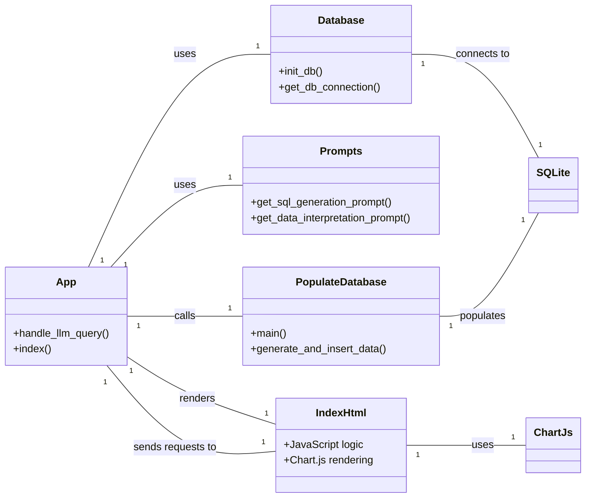

# Database MCP: Natural Language Query Interface

This project is a Flask-based web application that provides a natural language interface for querying a SQLite database. It uses the OpenAI API to convert user questions into SQL queries, executes them, and returns the results in a human-readable format.

## Features

- **Natural Language to SQL:** Converts plain English questions into SQLite queries.
- **Data Interpretation:** Summarizes database results in a clear, conversational way.
- **Interactive Web Console:** A simple, terminal-themed frontend for asking questions.
- **Realistic Sample Data:** Includes a script to populate the database with realistic, persona-based usage data.
- **Safety Features:** Includes basic checks for harmful SQL and a circuit breaker for large query results.

## Project Structure

```
.
├── .env                  # Stores environment variables (e.g., API keys)
├── .gitignore            # Specifies files for Git to ignore
├── app.py                # The main Flask application
├── database.py           # Handles database schema initialization
├── populate_database.py  # Script to populate the database with sample data
├── prompts.py            # Contains the prompt templates for the LLM
├── README.md             # This file
├── requirements.txt      # Python dependencies
├── templates/
│   └── index.html        # Frontend HTML and JavaScript
└── usage.db              # The SQLite database file (created automatically)
```

## Setup and Installation

### Prerequisites

- Python 3.8 or higher
- An OpenAI API Key

### 1. Clone the Repository

Clone the project to your local machine:

```bash
git clone https://github.com/Mohanavadivelu/database_mcp.git
cd database_mcp
```

### 2. Create a Virtual Environment

It is highly recommended to use a virtual environment to manage dependencies.

```bash
# For Windows
python -m venv venv
venv\Scripts\activate

# For macOS/Linux
python3 -m venv venv
source venv/bin/activate
```

### 3. Install Dependencies

Install the required Python packages using pip:

```bash
pip install -r requirements.txt
```

### 4. Configure Environment Variables

Create a file named `.env` in the root of the project directory. Add your OpenAI API key to this file:

```
OPENAI_API_KEY=your_openai_api_key_here
```

## How to Run the Application

With your virtual environment activated and the `.env` file configured, you can run the application with a single command:

```bash
python app.py
```

This will perform the following actions:
1.  Initialize the SQLite database (`usage.db`) if it doesn't exist.
2.  Check if the database is empty. If it is, it will run the `populate_database.py` script to fill it with realistic sample data.
3.  Start the Flask development server.

By default, the application will be available at `http://127.0.0.1:5000`. Open this URL in your web browser to access the natural language console.

## How to Use the Console

Once the application is running, you can ask questions in plain English. The system will attempt to generate a relevant chart (bar or line, depending on the data) along with a natural language answer.

**Important:** Enter one question at a time.

Here are some examples of prompts you can use:

### Examples for Chart Generation

**For Bar Charts (aggregated data):**
-   "Show me the total `duration_seconds` for each `application_name`."
-   "Count the number of unique `user`s for each `platform`."
-   "What are the top 5 `application_name`s by `duration_seconds`?"
-   "How many `legacy_app`s are there?"
-   "List the total `duration_seconds` for each `user`."

**For Line Charts (time-series data - may require specific date queries):**
-   "Show total `duration_seconds` per `log_date`."
-   "Daily usage trends for VSCode."

**General Queries:**
-   "What platforms are most common?"
-   "Show me the average session duration for each application."

You can also type `help` for more general examples or `clear` to clear the console screen.

## System Architecture

To help understand the project structure and data flow, here are a class diagram and a flow diagram. These diagrams are written in [Mermaid syntax](https://mermaid.js.org/), which can be rendered directly in GitHub, GitLab, VS Code, and other Markdown viewers.

### Class Diagram



### Request Flow Diagram

```mermaid
graph TD
    A[User Input (index.html)] --> B{Frontend JavaScript};
    B --> C[HTTP POST /api/llm_query];
    C --> D[Flask App (app.py)];
    D --> E{Text-to-SQL Prompt (prompts.py)};
    E --> F[OpenAI API];
    F --> G[Generated SQL Query];
    G --> H[Execute SQL (app.py)];
    H --> I[SQLite (usage.db)];
    I --> J[Query Results];
    J --> K{Data-to-Text Interpretation (prompts.py)};
    K --> L[OpenAI API];
    L --> M[Natural Language Answer];
    J --> N[Raw Data (JSON)];
    M & N --> O[Flask App Response];
    O --> P{Frontend JavaScript};
    P --> Q[Display Answer (index.html)];
    P --> R[Render Chart (Chart.js)];
```
